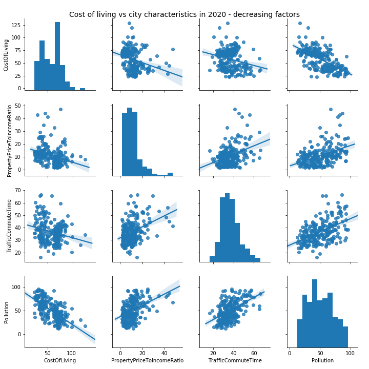

```{r setup, include=FALSE}
knitr::opts_chunk$set(echo = FALSE, fig.align = "center", out.width = "80%")
```

# Executive Summary

We have been analysing data for various city and country rankings and indices, measuring
overall quality of living (QoL).
These data were merged with additional statistics for cities and countries related to
health, environmental and economical situation.
The main focus was on the ranking published by Mercer, ranking and indices published by
Numbeo and statistics published by WHO, the United Nations, and other data collected 
by Gap Minder.

We found that the quality of living indices are going upwards - except for the last three years
where there is an small downwards trend visible.
Here one should also understand that the methodology of the rankings and indexes
used is continuously adjusted.

There is a strong correlation between the rankings published by Mercer and the one
calculated by Numbeo. Other city rankings (e.g. UN Habitat ranking) do not correlate
so well.

The correlation of country-level statistics (e.g. GDP per capita,
emission damage, health care system) to the city-level QoL ranking turned
out to be surprisingly high.
Almost 50% of the variance of the QoL index can be explained by country-level
statistics.

Similarly, the correlation with country-level QoL rankings (e.g. the Numbeo country ranking)
is again very high.
We looked into cities which are not following the country trend,
like Mumbai (vastly exceeding the QoL of India) and Rome (much lower
QoL as Italy).

We found that the three major characteristics determining the livability of a city
(according to these QoL rankings) are health care, cost of living and purchasing power.
On the other hand the QoL rankings suffer from high pollution rates, high property-to-income-ratios and long commute times (inefficient traffic).

Most of the analysis was performed on the year 2012 where the most data was available.
Additionally, some of the modelling has been performed on all available years.

# Questions answered

## Change of QoL Rankings and Indices over Time

The following plot shows the average index values over time for
the Quality of Live (QoL) identified by Numbeo, together with
the components which influence this index.

```{r}
knitr::include_graphics('visuals/RankingsOverTime.png')
```

## Correlation of City QoL Rankings with each other

```{r}
knitr::include_graphics('visuals/CorrelationOfMercerAndUNAndNumbeoRanking2012.png')
```

With this plot we investigated the correlation of the rankings identified by
Numbeo with those identified by Mercer as well as the UN Habitat data,
specifically looking into the year 2012 (where the most data was available).

The correlation between Numbeo and Mercer is very clearly visible; the correlation
to the UN Habitat ranking however is lower.

## Correlation of City QoL Rankings with Country Statistics

We looked into the correlation of health-related, economical and
environmental statistics of countries and their influence on the Quality of Living
for their cities.

The ranking datasets (from top: Mercer, Numbeo, UN) correlate differently with the Gapminder dataset containing population size, child deaths, income per person, CO2 emissions of the country, life expectancy and fertility:

```{r}


knitr::include_graphics('visuals/correlations0_un_prosperity.png')
```

We also looked into the correlation of available green area as well as various unemployment
measures on the rankings.

One of the outstandig results here was that visually the
Mercer rank was (slightly) negatively correlating with the available green area,
while Numbeo and UN Prosperity rank was (slightly) positively correlated.
Similarly there were differences in the influence (positive or negative) of
unemployment.

```{r, eval=TRUE}

knitr::include_graphics('visuals/correlations1_numbeo.png')

```
This shows that the indizes put different weights on the provided attributes.

## Correlation of City QoL Rankings with Country QoL Rankings

We compared every City QoL Ranking with Human Development Index as well as with Numbeo. The highest correlation was found between UN Prosperty and Human Development Index (HDI),
with a correlation of 0.927 (using Spearman's rank correlation coefficient).
Since both indices are created by UN agencies this high value is not surprising.
When looking at Numbeo's _City Ranking_ in correlation with the HDI _Country Ranking_
we still found a correlation of 0.748 based on Spearman.

```{r, eval=FALSE}

```

## Determining Factors for City QoL

We identified the following positive factors (ordered by relevance) for the
Quality of Living on city level:

* _Purchasing Power,_ _Cost of Living_, _Health Care_ and _Safety._ 

The following factors _reduce_ the quality of living:

* _Pollution,_ _Traffic Commute Time_ and _Property Price to Income Ratio._

We did not find a significant influence of _climate_ on the quality of living.

## Correlation of Cost of Living with other city-characteristics. 

Purchasing Power and Healthcare are indicators that the cost of living will also be high. 
```{r, eval=TRUE}

```

Pollution, inefficient traffic, and a high property-price-to-income-ratio (pptir)
correlate negatively with the cost of living index. 

```{r, eval=FALSE}

```

The _pptir_ is an indication on how long an average family has to work to buy
an average property(house/flat) in a city.
It is interesting to see that there is a _negative_ correlation between this
indicator and the cost of living. 
It may seem counterintuitive that it is easier to buy a house when
the cost of living is higher.
Our interpretation was that areas with higher cost of living usually correlate with
higher income, therefore reducing the _pptir_ value.