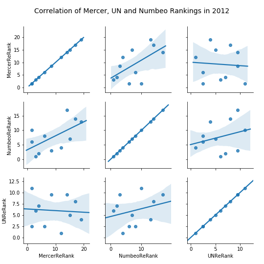

```{r setup, include=FALSE}
knitr::opts_chunk$set(echo = FALSE)
```
# Report

## Executive Summary

We have been analysing data for various city and country rankings and indices, measuring
overall quality of live (QoL).
These data were merged with additional statistics for cities and countries related to
health, environmental and economical situation.

Our goal was answering the questions:

* How do the rankings change over time?
* How do these rankings correlate with each other for one specific year?
* How do they correlate with other statistics about the countries in which
  the cities are located?
  How do they correlate with quality of life rankings of the country
  in which the cities are located?
* What are the determining characteristics for livability of a city?
  How do they correlate with cost of living?
  
We found that - with some recent changes, potentially related to the economic crisis
starting in 2007 - the quality of live indices are going upwards.

There is a strong correlation between the indices published by Mercer and the one
calculated by Numbeo.

TODO - correlation with country QoL rankings

TODO - correlation with country statistics

We found that the three major characteristics determining the livability of a city
(according to these QoL rankings) are health care, cost of living and purchasing power.

## Change of QoL Rankings and Indices over Time

The following plot shows the average index values over time for
the Quality of Live (QoL) identified by Numbeo, together with
the components which influence this index.

```{r, out.width="100%"}
knitr::include_graphics('visuals/RankingsOverTime.png')
```

## Correlation of City QoL Rankings with each other

With this plot we investigated the correlation of the rankings identified by
Numbeo with those identified by Mercer as well as the UN Habitat data,
specifically looking into the year 2012 (where the most data was available).

```{r, out.width="100%"}

```

The correlation betweek Numbeo and Mercer is very clearly visible; the correlation
to the UN Habitat ranking however is very small.

## Correlation of City QoL Rankings with Country Statistics

## Correlation of City QoL Rankings with Country QoL Rankings

## Determining Factors for City QoL

```{r, out.width="100%"}
knitr::include_graphics('visuals/CorrelationOfRankingsIn2020WithOutliers.png')
```
