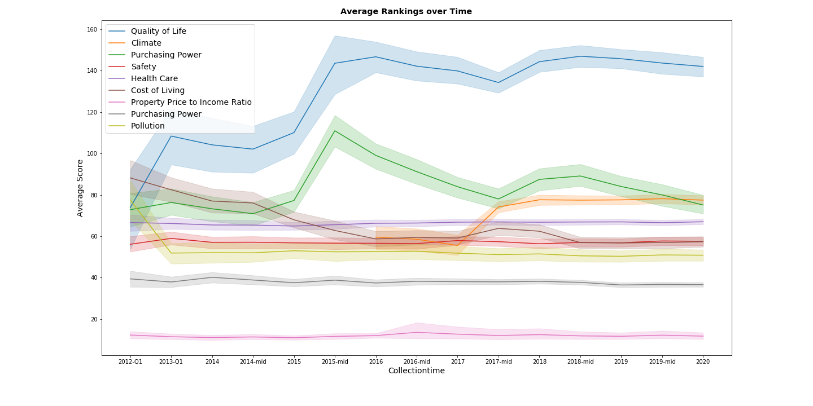

```{r setup, include=FALSE}
knitr::opts_chunk$set(echo = FALSE)
```

# Executive Summary

We have been analysing data for various city and country rankings and indices, measuring
overall quality of living (QoL).
These data were merged with additional statistics for cities and countries related to
health, environmental and economical situation.
The main focus was on the ranking published by Mercer, ranking and indices published by
Numbeo and statistics published by WHO, the United Nations, and other data collected 
by Gap Minder.

Our goal was to answer the questions:

* How do the rankings change over time?
* How do these rankings correlate with each other for one specific year?
* How do they correlate with other statistics about the countries in which
  the cities are located?
* How do they correlate with quality of living rankings of the country
  in which the cities are located?
* What are the determining characteristics for livability of a city?
  How do they correlate with cost of living?

We found that the quality of living indices are going upwards - except for the last three years
where there is an small downwards trend visible.
Here one should also understand that the methodology of the rankings and indexes
used is continuously adjusted.

There is a strong correlation between the rankings published by Mercer and the one
calculated by Numbeo. Other city rankings (e.g. UN Habitat ranking) do not correlate
so well.

The correlation of country-level statistics (e.g. GDP per capita,
emission damage, health care system) to the city-level QoL ranking turned
out to be surprisingly high.
Almost 50% of the variance of the QoL index can be explained by country-level
statistics.

Similarly, the correlation with country-level QoL rankings (e.g. the Numbeo country ranking)
is again very high.
We looked into cities which are not following the country trend,
like Mumbai (vastly exceeding the QoL of India) and Rome (much lower
QoL as Italy).

We found that the three major characteristics determining the livability of a city
(according to these QoL rankings) are health care, cost of living and purchasing power.
On the other hand the QoL rankings suffer from high pollution rates, high property-to-income-ratios and long commute times (inefficient traffic).

# Questions answered

## Change of QoL Rankings and Indices over Time

The following plot shows the average index values over time for
the Quality of Live (QoL) identified by Numbeo, together with
the components which influence this index.

```{r, out.width="80%"}

```

## Correlation of City QoL Rankings with each other

```{r, out.width="80%"}
knitr::include_graphics('visuals/CorrelationOfMercerAndUNAndNumbeoRanking2012.png')
```

With this plot we investigated the correlation of the rankings identified by
Numbeo with those identified by Mercer as well as the UN Habitat data,
specifically looking into the year 2012 (where the most data was available).

The correlation between Numbeo and Mercer is very clearly visible; the correlation
to the UN Habitat ranking however is lower.

## Correlation of City QoL Rankings with Country Statistics

We looked into the correlation of health-related, economical and
environmental statistics of countries and their influence on the Quality of Living
for their cities.

As an example here a plot of the correlation between GDP per capita
(purchase-power adjusted) and QoL:
```{r, out.width="80%"}

```

## Correlation of City QoL Rankings with Country QoL Rankings

## Determining Factors for City QoL

```{r, out.width="80%"}
knitr::include_graphics('visuals/CorrelationOfRankingsIn2020WithOutliers.png')
```


## Correlation of Cost of Living with other city-characteristics. 

Purchasing Power and Healthcare are indicators that the cost of living will also be high. 
```{r, out.width="100%"}
knitr::include_graphics('visuals/CostOfLivingCorrelationIn2020.png')
```

Pollution, inefficient traffic, and a high property-price-to-income-ratio (pptir) reduce the cost of living index. 

```{r, out.width="100%"}
knitr::include_graphics('visuals/CostOfLivingCorrelationIn2020NegativeInfluencers.png')
```

The pptir is an indication on how long an average family has to work to buy an average property(house/flat) in a city. It is interesting to see that there is a negative correlation between this indicator and the cost of. 
It may seem counterintuitive that it is easier to buy a house when the cost of living is higher.